## Hey, I'm Alan Xu 👋.

I'm now trying different directions to find what I like.
* 🧐 Enjoy any project that uses the Go, Rust and Solidity programming language.
* 💻 With 4 years of Software Engineering education and 4 years of development working experience.
* ✍🏻 Blog at [xdpcs.github.io](https://xdpcs.github.io).
* 📧 Reach me by [sending me an email](mailto:xdpcsyy@gmail.com).
---

  
Some of my Github Public Stats 💻

   

